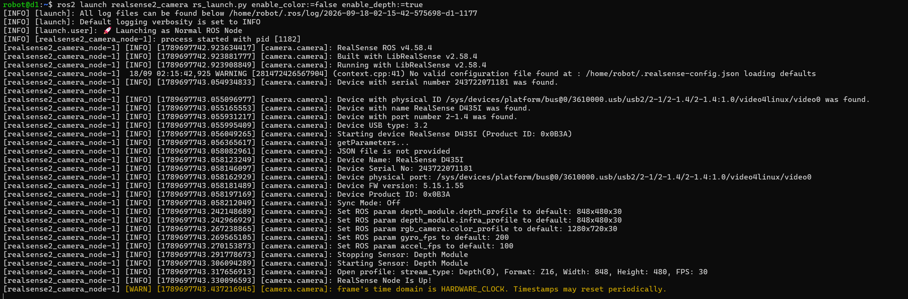
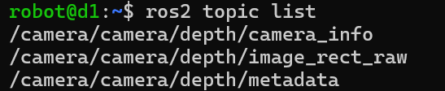
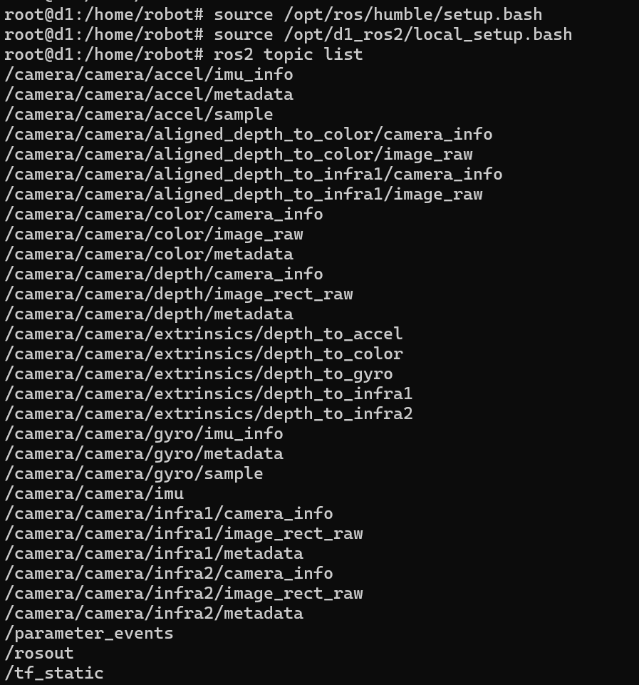

# Intel RealSense D435i 开发文档

本文档面向在 D1 机器人上进行 D435i 相关开发/调试的工程师，说明：

1. 需要安装哪些依赖
2. 项目里各个 ROS2 节点是怎么发布/启动的
3. 除了走 ROS2 话题，如何用 **pyrealsense2 Python SDK** 直接读取相机数据

---

## 1. 依赖安装

系统前提：Ubuntu 22.04 + ROS2 Humble（D1 出厂镜像已预装 `/opt/ros/humble`）。

### 1.2 ROS2 侧依赖

```bash
sudo apt install -y \
    ros-humble-realsense2-camera \
    ros-humble-cv-bridge \
    python3-numpy \
    python3-opencv \
    python3-pip
```

### 1.3 Python 侧依赖

如果要用 **pyrealsense2 SDK** 直接读相机（见第 3 节），额外装：

```bash
pip3 install pyrealsense2
```

> 注意：ROS2 官方节点内部已经链接了系统的 `librealsense2`，`pip install pyrealsense2` 装的是独立的 Python 预编译包，两者互不冲突，可以同时装，分别用于"过 ROS2 话题读"和"脱离 ROS2 直接读"两种场景。

---

## 2. 怎么发布各个 ROS2 节点

```bash
source /opt/ros/humble/setup.bash
source /opt/d1_ros2/local_setup.bash
ros2 launch realsense2_camera rs_launch.py enable_color:=false enable_depth:=true
```

- 只开深度流（`enable_depth:=true`），关掉彩色流（`enable_color:=false`）以节省算力和带宽，本项目只用深度数据做避障。
- 发布的关键话题：
  | 话题 | 类型 | 用途 |
  |---|---|---|
  | `/camera/camera/depth/image_rect_raw` | `sensor_msgs/Image` | 校正后的原始深度图（16UC1，单位 mm） |
  | `/camera/camera/depth/camera_info` | `sensor_msgs/CameraInfo` | 深度相机内参（fx/fy/cx/cy） |

手动调试时可以直接跑这条 launch 命令，不必走 systemd：

```bash
source /opt/ros/humble/setup.bash
ros2 launch realsense2_camera rs_launch.py enable_color:=false enable_depth:=true
```







常用参数（追加在命令后）：

```bash
depth_module.profile:=640x480x30   # 分辨率x帧率
pointcloud.enable:=false           # 本项目不需要点云，保持关闭省算力
```

### 2.4 开启全部数据流（完整参数）

`rs_launch.py` 启动的始终是同一个 `realsense2_camera_node`，"支持所有参数"不需要另开节点，只是把想要的数据流对应参数都打开即可。先查看该 launch 文件支持的全部参数：

```bash
ros2 launch realsense2_camera rs_launch.py --show-args
```

把常用的流全部打开（彩色 + 深度 + 双目红外 + IMU + 点云 + 深度对齐彩色）的示例（imu为iio设备，默认情况需要root下才有权限读取，此次在root用户开启节点）：

```bash
ros2 launch realsense2_camera rs_launch.py \
    enable_color:=true \
    enable_depth:=true \
    enable_infra1:=true \
    enable_infra2:=true \
    enable_gyro:=true \
    enable_accel:=true \
    unite_imu_method:=2 \
    align_depth.enable:=true \
    pointcloud.enable:=true \
    depth_module.depth_profile:=640x480x30 \
    rgb_camera.color_profile:=640x480x30
```





> **不建议在 D1 上常驻开启全部流。`enable_color:=false` 是为了省 USB 带宽和 CPU（尤其 pointcloud、彩色流、双红外同时开对小板子算力压力明显）。全参数命令更适合临时调试、标定或验证某路数据是否正常。

### 2.5 常用 ROS2 排查命令

```bash
ros2 node list                                            # 应能看到 /camera/camera 和 /d435i_obstacle_avoidance
ros2 topic list                                            # 查看当前所有话题
ros2 topic hz /camera/camera/depth/image_rect_raw          # 查看深度图发布频率，正常应接近相机帧率
ros2 topic echo /d1/command/user_command                   # 查看跟随节点实际发布的控制指令
ros2 topic info /camera/camera/depth/image_rect_raw -v     # 查看话题的 QoS 设置，排查订阅不到数据的问题
```

> 两个服务都设置了 `Environment="ROS_DOMAIN_ID=42"` 和 `ROS_LOCALHOST_ONLY=1`，本机手动调试/排查时也要 `export` 同样的环境变量，否则节点互相发现不了。

---

## 3. 怎么用 Python SDK 直接读取 D435i

如果要脱离 ROS2、直接通过sdk读取相机数据，可以用 Intel 官方的 **pyrealsense2** SDK 直接读，无需启动任何 ROS2 节点。

### 3.1 最小读取示例

```python
import pyrealsense2 as rs
import numpy as np

pipeline = rs.pipeline()
config = rs.config()
config.enable_stream(rs.stream.depth, 640, 480, rs.format.z16, 30)

profile = pipeline.start(config)

# 拿相机内参，对应项目里 camera_info_callback 用到的 fx/fy/cx/cy
depth_stream = profile.get_stream(rs.stream.depth).as_video_stream_profile()
intr = depth_stream.get_intrinsics()
print(f"fx={intr.fx}, fy={intr.fy}, cx={intr.ppx}, cy={intr.ppy}")

try:
    while True:
        frames = pipeline.wait_for_frames()
        depth_frame = frames.get_depth_frame()
        if not depth_frame:
            continue

        # 转成 numpy 数组，单位 mm，和 image_rect_raw 话题里的编码一致（16UC1）
        depth_image = np.asanyarray(depth_frame.get_data())
        center_val = depth_image[240, 320]
        print(f"画面中心深度: {center_val} mm")
finally:
    pipeline.stop()
```

### 3.2 读取 IMU（D435i 独有，D435 没有）

D435i 相比 D435 多了六轴 IMU（加速度计 + 陀螺仪），本项目目前没有用到，但如果后续要做姿态补偿可以这样读：

```python
import pyrealsense2 as rs

pipeline = rs.pipeline()
config = rs.config()
config.enable_stream(rs.stream.accel)
config.enable_stream(rs.stream.gyro)
pipeline.start(config)

try:
    while True:
        frames = pipeline.wait_for_frames()
        accel = frames.first_or_default(rs.stream.accel)
        gyro = frames.first_or_default(rs.stream.gyro)
        if accel:
            a = accel.as_motion_frame().get_motion_data()
            print(f"accel: x={a.x:.2f} y={a.y:.2f} z={a.z:.2f}")
        if gyro:
            g = gyro.as_motion_frame().get_motion_data()
            print(f"gyro: x={g.x:.2f} y={g.y:.2f} z={g.z:.2f}")
finally:
    pipeline.stop()
```
---

## 4. 参考

- 官方 ROS2 wrapper 文档：https://github.com/IntelRealSense/realsense-ros
- 官方 Python SDK 文档：https://github.com/IntelRealSense/librealsense/tree/master/wrappers/python
